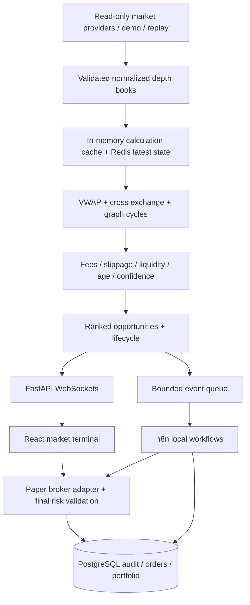

# Real time crypto exchange and arbitrage trading

### A real-time market terminal built around arbitrage intelligence

**ARBITRAGE X** combines live public crypto feeds, continuous cross-exchange comparisons, publisher news and a clearly labeled hackathon buy/sell simulation. Its Python quant engine checks executable depth, fees, slippage, latency and risk before qualifying opportunities. Built-in executions use paper funds; external exchange links do not place orders.

Indian Stocks provides a 20-company NSE catalog and a server-side Kite quote connector; actual quotes require credentials. Stripe subscription checkout also requires merchant configuration. No LLM is activated. See [connection options](docs/CONNECTIONS.md) and [verification](docs/VERIFICATION.md).

The website starts at Home on every fresh visit. Open Arbitrage for the live monitor or select **Try arbitrage demo → Buy with demo funds → Sell demo BTC** to demonstrate a full synthetic cycle.

## Quick start

```sh
docker compose up --build
```

- Terminal: http://localhost:8080
- FastAPI / OpenAPI: http://localhost:8000/docs
- Self-hosted n8n Community Edition: http://localhost:5678

Compose starts frontend, backend, PostgreSQL, Redis, and n8n. Complete n8n's local owner setup and import/activate the supplied workflows as described in [automation/README.md](automation/README.md). The terminal and quant engine work before n8n is configured. Auto paper trading is **OFF** by default and disarms on backend restart.

### Run without Docker

Python 3.12+ and Node.js 22+:

```sh
python -m venv .venv
# Windows: .venv\Scripts\activate
# macOS/Linux: source .venv/bin/activate
pip install -r backend/requirements.txt
uvicorn backend.app.main:app --host 127.0.0.1 --port 8000
```

In another terminal:

```sh
cd frontend
npm install
npm run dev
```

Open http://localhost:5173. Local development explicitly uses SQLite and an in-memory cache when database/Redis URLs are absent. Docker uses PostgreSQL and Redis. A configured database failure does not silently switch to another database; a Redis failure falls back to memory and shows a degraded state.

Do not copy the Compose database URL into a native local session unless those containers are running and reachable. `.env.example` describes the available variables. The frontend has a separate `frontend/.env.example` for independently hosted APIs.

## Problem and solution

Displayed spreads are not executable returns. Last-trade prices ignore the bid/ask spread, limited depth, fees, stale quotes, and the need to fund both venues. ARBITRAGE X exposes those costs and assumptions before a user simulates execution.

The market terminal provides search, keyboard navigation, venue comparisons, watchlists, depth, risk breakdowns, and an execution ledger. A transparent score ranks qualified opportunities; **no trained AI model or guaranteed accuracy is claimed**.

## What is implemented

- Cross-exchange comparisons of the same instrument, quote currency, data source, and settlement model.
- Bellman-Ford negative-cycle precheck followed by exact three-leg cycle enumeration and depth replay.
- Fee-aware ask/bid VWAP sweeps, full-fill rejection for insufficient arbitrage depth, confidence scoring, risk limits, stable active route identities.
- Five-venue deterministic demo generator, 22 crypto assets, ETH/BTC conversion books, and three clearly simulated US equities on two synthetic venues.
- Public read-only REST depth adapters for Binance, Coinbase Exchange, Kraken, OKX, and Bybit; bounded timeouts, independent retry/backoff, and labeled fallback. No trading credentials or real order client exists.
- Live API-to-browser WebSockets, bounded subscriber queues, heartbeat/reconnect, stale quote filtering, timestamps, and structured events.
- Manual market and limit paper orders, partial fills, cancellation, inventory/cash reservations, long-only positions, bid marks, realized/unrealized P&L, and restart persistence.
- Arbitrage simulation with final validation after configurable latency. Optional **explicit demo scenarios** show a partial sell leg or adverse-move rejection. Residual inventory is recorded, not hidden as a completed arbitrage.
- Replay play/pause and 1×/2×/5×/10× speed. Full order-book snapshots are required; no fabricated historical price series.
- Backtesting, session reports, lifecycle/audit logging, event-only n8n integration, shared-token authentication on automation callbacks, and a kill switch.
- Desktop terminal, instrument page, market/strategy filters, persisted/reorderable watchlists, search (Ctrl/Cmd+K), order book, trading, analytics, automation, and system monitoring.

## Data integrity and honest limits

| Label | Meaning |
|---|---|
| DEMO | Generated prices/books. Never live exchange data. |
| LIVE | Actual provider snapshot received by the backend. Execution remains paper-only. |
| REPLAY | Recorded snapshots re-timed for playback, preserving original quote age. |
| STALE | Quote exceeds the configured age limit; excluded from detection. |
| Unavailable | No provider delivers this field/market; the UI displays an em dash. |

`DATA_MODE=demo` is the reproducible credential-free default. `DATA_MODE=live` attempts the public crypto adapters; availability varies by geography and listed USDT pairs. Failed providers use individually labeled demo fallback; **live and demo books never enter the same opportunity**. Live equity and index feeds are disabled until an appropriately licensed depth/session adapter is supplied. Indian equities are not fabricated or compared across incompatible listings.

Binance uses public partial-depth WebSockets with a REST fallback; the other initial live adapters poll REST depth. Browser updates and selected order books use WebSockets. Binance partial-depth messages lack an exchange timestamp, so arrival time and the measured ping RTT are disclosed internally; freshness cannot reconstruct unknown upstream age. Exchange streaming adapters can extend `MarketDataProvider`; the MVP does not claim native streaming support at every exchange. Actual last-trade, volume, previous close, 24-hour return, historical OHLC, and official equity holiday/session calendars are unavailable in these depth-only feeds. Session charts use collected midquotes; candles are explicitly labeled aggregates of those samples, not exchange trade candles.

Fee rates are configurable **estimates**, not a verified account fee tier. Displayed depth does not guarantee live execution. Exchange lot-size rounding, minimum notional, maker queue priority, transfer availability, settlement failures, borrow costs, tax, and dynamic rebalancing are outside this MVP. It is a hackathon system, not production trading infrastructure.

## Architecture



`backend/app/` separates models, settings, providers, order-book math, graph algorithms, detector, risk, analytics, cache, persistence, scanner, paper broker, replay, automation, and API composition. `frontend/src/` separates market connection, types, charts, panels, tables, terminal shell, and execution/automation modules.

The backend must run **one worker/replica**. In-memory matching locks and reservations coordinate this process. Redis pub/sub publishes updates but does not turn the paper account into a distributed ledger. Multiple replicas would need distributed execution ownership and transactional reservation tables first.

## Arbitrage mathematics

For requested base quantity `q`, consume asks for the buy and bids for the sell:

```text
buy_vwap  = sum(ask_price_i * filled_qty_i) / q
sell_vwap = sum(bid_price_i * filled_qty_i) / q
gross_profit = (sell_vwap - buy_vwap) * q
buy_fee  = buy_vwap * q * buy_fee_rate
sell_fee = sell_vwap * q * sell_fee_rate
residual_slippage = (buy_notional + sell_notional) * reserve_bps / 10000
net_profit = gross_profit - buy_fee - sell_fee - residual_slippage - other_costs
capital_required = buy_notional + buy_fee + marked_sell_inventory
net_edge_percent = net_profit / capital_required * 100
```

Depth impact is **already in VWAP** and is disclosed separately; it is not subtracted a second time. Capital includes prefunded sell inventory. There is no on-critical-path transfer, so network cost is zero; rebalancing costs are excluded and disclosed. Cash-like quote budgets are supported for USD/USDT/INR; a configured `1000` notional is never accidentally interpreted as 1000 BTC.

For triangular routes, construct directed rates and weights `-log(rate_after_fee)`. A Bellman-Ford precheck detects negative cycles; bounded enumeration finds three-leg cycles starting in USDT. Each candidate then consumes real depth at every conversion. Fees are taken from each leg's output. Total fee drag in the starting currency equals fee-free terminal output minus fee-bearing terminal output. A residual reserve is charged once per leg.

The confidence score is a normalized configurable weighted combination of edge, liquidity, depth, age, latency, persistence, slippage, volatility, and venue reliability. It is a transparent heuristic, not a probability or ML prediction.

## Paper accounting and execution

- Separate quote-currency ledgers; never add USD, USDT, BTC, and INR as if they were identical.
- Market orders use displayed depth and cancel any unfilled IOC remainder.
- Limit orders fill only at marketable displayed levels at or better than their limit. No exchange queue priority is claimed.
- Open buy orders reserve cash including estimated fees. Open sell orders reserve inventory at the selected venue. Short selling is disabled.
- Buy fees enter cost basis. Sell proceeds minus sell fees and allocated basis become realized P&L. Open positions mark to bid. Missing/stale marks fall back to cost with a visible stale flag.
- A partially filled arbitrage retains the unmatched purchase as an open position. Capitalized fees are separated from fees recognized on the completed portion.
- Idempotency keys return the original result; conflicting request reuse is rejected. Shared snapshot reservations prevent manual/arbitrage double consumption.
- Fills and account state are persisted before acknowledgement. Filling rolls back memory on storage failure.
- Auto execution checks its switch and thresholds **again under the execution lock**, after simulated latency. The kill switch disables new automated executions, not already committed fills or manually opened orders.

## Environment variables

| Variable | Default | Meaning |
|---|---:|---|
| DATA_MODE | demo | demo or live; replay is loaded through the API |
| DATABASE_URL | SQLite locally | SQLAlchemy async URL; Compose supplies PostgreSQL |
| REDIS_URL | empty locally | Latest books/prices/opportunities, TTLs, pub/sub |
| TRADE_NOTIONAL | 1000 | Requested quote notional per arbitrage route |
| MAX_TRADE_SIZE | 10000 | Maximum simulated trade capital |
| MIN_NET_EDGE_PERCENT | 0.03 | Strict positive net edge threshold |
| MIN_LIQUIDITY | 40 | Minimum 0–100 liquidity score |
| MAX_SLIPPAGE_PERCENT | 0.25 | Maximum modeled execution impact/reserve |
| MAX_PRICE_AGE_MS | 5000 | Stale book cutoff |
| MAX_LATENCY_MS | 1500 | Maximum modeled route latency |
| MIN_CONFIDENCE_SCORE | 60 | Minimum confidence |
| STARTING_CAPITAL | 100000 | Starting simulated balance per quote currency |
| SNAPSHOT_INTERVAL_SECONDS | 30 | Database book/price/opportunity sampling |
| CONFIDENCE_WEIGHTS | JSON defaults | All nine nonnegative weights, positive total |
| EXECUTION_DELAY_MS | 80 | Delay before final paper revalidation |
| MAX_POSITION_NOTIONAL | 25000 | Maximum long position exposure |
| MAX_DRAWDOWN_PERCENT | 15 | Account drawdown cutoff |
| AUTO_PAPER_TRADE | false | Auto paper execution switch |
| MAX_DAILY_PAPER_TRADES | 20 | Daily paper trade/order guardrail (UTC day) |
| N8N_WEBHOOK_URL | empty locally | Optional workflow event receiver |
| AUTOMATION_TOKEN | empty locally | Shared backend/n8n callback token |
| CORS_ORIGINS | localhost defaults | Comma-separated frontend origins |

Never put secrets into `VITE_*` variables. `.env` files are ignored. Docker binds exposed ports to localhost. This is a single-user local workspace without user authentication. Before public deployment, add authentication, request limits, TLS, scoped permissions, and account isolation; do not expose unauthenticated simulation controls or n8n to the internet.

## Storage and performance

SQLAlchemy uses one indexed `records` envelope table with typed `kind` categories for assets, exchanges, markets, price/order-book snapshots, opportunities/history, paper trades, execution state, portfolio, reports, audit events, and delivery failures. JSON payloads preserve full records. Indexes cover symbol, exchange, timestamp, opportunity ID, edge, status, and kind/time. This is an explicit MVP schema tradeoff; normalized relational models and migrations belong in the next iteration.

Hot calculations read memory; Redis holds TTL-scoped latest state and publishes snapshots. PostgreSQL receives interval snapshots and durable executions/events. Slow consumers keep only the newest WebSocket frame. The UI renders capped tables and updates at roughly 1 Hz; collected chart history is bounded. Data is not retained indefinitely in memory, but database retention/partitioning must be configured for long-running deployments.

## API

Interactive schemas: `/docs`.

```text
GET  /health                         GET  /markets
GET  /prices                         GET  /orderbooks/{exchange}/{symbol}
GET  /opportunities                  GET  /opportunities/{id}
GET  /portfolio?quote=USDT            GET  /paper-trades
POST /paper-trades/execute            GET  /analytics
GET  /history/{exchange}/{symbol}     POST /backtest
GET  /orders                         POST /orders
POST /orders/{id}/cancel              GET  /positions?quote=USDT
GET  /automation                     PUT  /automation/config
POST /automation/kill                POST /automation/execute
POST /automation/notify               GET  /system
GET  /reports                        POST /reports
POST /replay/load                     POST /replay/control
WS   /ws/market                      WS   /ws/opportunities
```

Example paper market order:

```json
{"symbol":"BTC/USDT","venue":"Binance","side":"BUY","order_type":"MARKET","quantity":0.001,"idempotency_key":"unique-request-0001"}
```

Backtest/replay input is `{ "frames": [[OrderBook, OrderBook], ...] }`. Each frame must be nonempty and strictly chronological by its maximum receive timestamp. `tools/record_session.py` records an actual running session into that format; the source labels remain intact.

## Testing

```sh
python -m pytest -q
cd frontend
npm run build
```

Tests cover VWAP, partial depth, zero/invalid prices, fees, double-counted slippage regression, graph cycles, risk/staleness, incompatible instruments/sources, deduplication, paper execution/idempotency/restart, WebSocket/API integration, manual order accounting, reservations/cancellation, partial fills, overlapping routes, storage rollback, replay ages, automation thresholds, n8n failure isolation, and workflow export structure.

See [docs/VERIFICATION.md](docs/VERIFICATION.md) for the checks performed in this environment and any unresolved runtime limits. Export validation is not equivalent to running n8n inside Docker.

## Hackathon demo sequence

1. Terminal: explain the DEMO/LIVE source label and separate paper execution label.
2. Search BTC with Ctrl/Cmd+K, open its instrument and compare venues.
3. Open Order Book and explain why a last-trade spread is insufficient.
4. Arbitrage: inspect a qualified route and its net cost/risk breakdown.
5. Paper execute. Inspect leg results and the execution ledger.
6. In demo mode, show the partial sell scenario; open Paper Trading → Positions to see residual exposure.
7. Place/cancel a limit paper order and observe cash reservations.
8. Automation: show OFF default, guarded callback, event log, and kill switch.
9. Analytics: generate a report or replay a recorded depth session.

## Vercel and submission

Use `frontend` as the Vercel root with the included `vercel.json`. Set `VITE_API_URL=https://your-backend` and `VITE_WS_URL=wss://your-backend/ws/market`. Host the **persistent** FastAPI scanner separately; a static frontend deployment alone does not run the market engine. Set the backend's `CORS_ORIGINS` to the exact Vercel origin, and secure public access first. This repository does not claim a public URL or GitHub submission until those services are actually configured.

The participant handbook asks for a public GitHub repository, Vercel URL, and a five-slide deck. Team names, contacts, and final submission URLs must be supplied by the team; they are not invented here. See [docs/SUBMISSION.md](docs/SUBMISSION.md).

## Roadmap

Licensed equity session/depth adapters; native exchange streaming and sequence-gap resynchronization; real exchange precision/min-notional rules; realistic maker queues and transfer/rebalance models; authenticated multi-user accounts; normalized schemas/migrations and retention; distributed matching ownership; replay analytics with contiguous opportunity-duration episodes; trained persistence models only after validated datasets exist.

## Disclaimer

“This application is an educational/hackathon paper-trading system. It does not execute real trades and does not constitute financial advice. Market data may be delayed, simulated, incomplete, or subject to provider limitations.”

## News, continents, and Zerodha order review

The Market News module fetches actual publisher RSS headlines from BBC and CoinDesk through `/news`, caches for five minutes, and preserves source URLs and original publication times. Regions include Africa, Asia, Europe, North/South America, Oceania, and Middle East coverage. No headlines are generated. Cached/unavailable publisher feeds are explicitly marked.

Continents displays representative regular equity-session windows with local clocks and IST conversions. These are indicative weekday windows, not an exchange holiday calendar or live open/closed signal. Links to each exchange's official calendar are provided.

Live Trading provides Zerodha Kite's official offsite order-review flow for NSE/BSE equities. Supply your app's public API key in the local screen (or optional `VITE_KITE_API_KEY` at build time), prepare the order and continue to Kite. Login and final execution are performed by the user on Zerodha. The app does not load private API secrets or account access tokens, and does not claim to have executed orders merely because Kite opened. Brokerage quotes, fills and holdings are reviewed in Kite. Paper-engine balances are independent.

All displayed application timestamps use Asia/Kolkata; regional clocks additionally show their venue's local time. Light/dark themes persist in browser storage. The visual news-card and palette reference is user-supplied Arbitrage3X.jsx; its simulated headlines are not used.

## App subscriptions

The Subscription module integrates Stripe-hosted Checkout, Customer Portal and signed subscription webhooks. Follow [Stripe setup](docs/BILLING.md) to configure test credentials and the recurring price. It remains unconfigured until those server settings exist. No payment is taken by running this preview. Subscription changes emit a local n8n event after verified processing. Production account identity and paid feature authorization are not enabled in this single-user preview.
